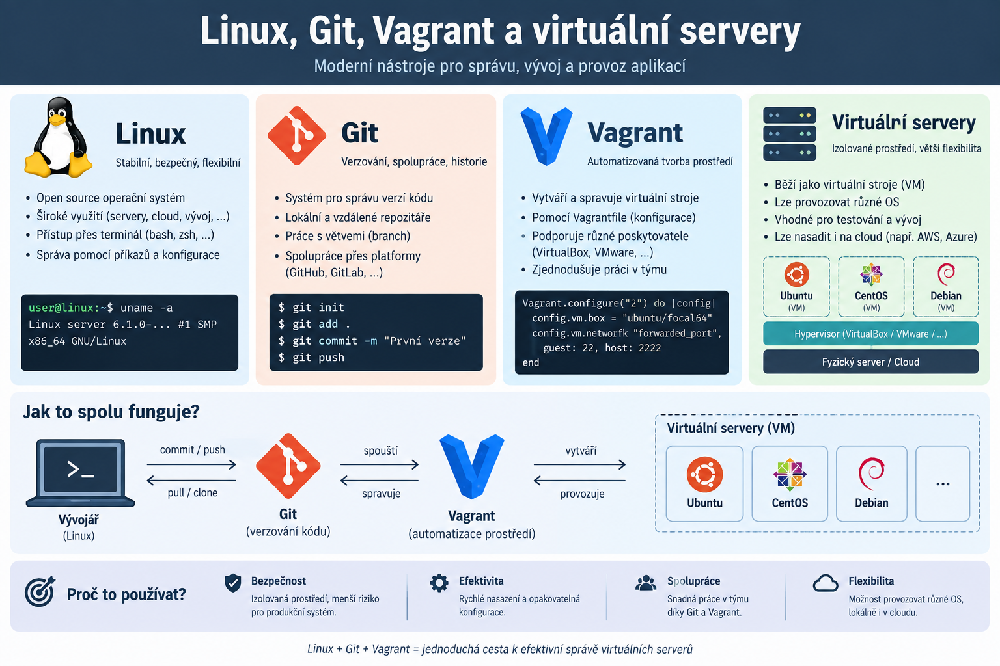

# Git a Vagrant – první Linux server

Úvodní samostatná práce z předmětu **Operační systémy (OSY)** pro **3. I** na [SPOŠ Dvůr Králové nad Labem](https://www.sposdk.cz/).

Vyberte si Linuxovou distribuci a pomocí Vagrantu si připravte vlastní virtuální server. Jeho konfiguraci uložte do svého repozitáře v GitHub Classroom, abyste prostředí mohli znovu vytvořit i na jiném počítači.


## 1. Příprava repozitáře

- Přijměte zadání v GitHub Classroom pomocí odkazu od vyučujícího.
- Naklonujte si **svůj studentský repozitář** do počítače a otevřete jej v editoru.
- Ověřte, že máte k dispozici Git, Vagrant a VirtualBox.

## 2. Vyberte si distribuci a připravte server

- V ročníkovém projektu otevřete adresář [Vagrant s příklady jednotlivých VM](https://github.com/sposdknl/2026-sposdk-osy/tree/main/Vagrant).
- Vyberte si jednu **Linuxovou distribuci**, například **Debian 13**. Příklady pro FreeBSD nejsou Linuxové distribuce.
- V kořeni svého repozitáře vytvořte adresář pro svůj server, například `srv01`.
- Do něj zkopírujte konfiguraci vybrané distribuce a pojmenujte ji přesně **`Vagrantfile`**, bez přípony. Pro Debian 13 použijte soubor [Vagrantfile-debian](https://github.com/sposdknl/2026-sposdk-osy/blob/main/Vagrant/Vagrantfile-debian).
- Prohlédněte si konfiguraci: najděte název boxu, velikost RAM, počet CPU a jméno virtuálního serveru. Ve vzoru pro Debian 13 je box `bento/debian-13`.

> Kopírujete konfiguraci virtuálního stroje, nikoli instalační ISO. Obraz systému si Vagrant stáhne při prvním spuštění.

## 3. Ošetřete soubory, které do Gitu nepatří

V kořeni repozitáře vytvořte soubor **`.gitignore`** a vložte do něj pravidlo:

```gitignore
.vagrant/
```

Pokud už soubor existuje, pravidlo zkontrolujte a případně doplňte. Toto pravidlo ignoruje adresáře `.vagrant` i uvnitř složek jednotlivých serverů, například `srv01/.vagrant/`.

Vagrant do `.vagrant/` ukládá místní stav virtuálního stroje. Tento adresář se do Gitu **neodevzdává**. Naopak soubory `.gitignore` a `srv01/Vagrantfile` do repozitáře patří.

## 4. Spusťte svůj server

V terminálu na svém počítači přejděte z kořene repozitáře do adresáře serveru a spusťte jej:

```bash
cd srv01
vagrant up
vagrant status
vagrant ssh
```

První spuštění může trvat déle kvůli stažení boxu. Po přihlášení do Linuxu ověřte distribuci:

```bash
cat /etc/os-release
```

Z virtuálního serveru se odhlaste příkazem `exit`. Po dokončení práce můžete server vypnout příkazem `vagrant halt`, který zadáte na svém počítači v adresáři `srv01`.

## 5. Vygenerujte kontrolní kód na serveru

Přihlaste se do serveru příkazem `vagrant ssh`. Následující příkazy spusťte **uvnitř virtuálního serveru**, ve svém domovském adresáři. Skript nevyžaduje `sudo`.

Stáhněte si [ověřovací skript](./overeni-serveru.sh):

```bash
cd ~
curl -fL https://raw.githubusercontent.com/sposdknl/git-vagrant/main/overeni-serveru.sh -o overeni-serveru.sh
```

Pokud nemáte `curl`, můžete použít `wget`:

```bash
wget -O overeni-serveru.sh https://raw.githubusercontent.com/sposdknl/git-vagrant/main/overeni-serveru.sh
```

Prohlédněte si skript a spusťte jej bez argumentů:

```bash
cat overeni-serveru.sh
bash overeni-serveru.sh
```

Skript ověří Linux a rozpoznanou virtualizaci a vypíše unikátní kontrolní kód i záznam s distribucí, hostname, kernelem a časem. **Celý vypsaný Markdown blok (kód i záznam) vložte do části Moje řešení.** Každé spuštění vytvoří nový kód; odevzdejte jeden odpovídající pár kódu a záznamu.

Kód slouží jako kontrolní záznam pro vyučujícího. Veřejný skript nemůže zaručit pravost výsledku ani sám prokázat, že VM vznikla Vagrantem; součástí odevzdání proto zůstává funkční `Vagrantfile` a případné předvedení serveru.

## 6. Bonus: vlastní tematický obrázek

- Nechte si pomocí AI vytvořit vlastní obrázek na téma **Linux, Git, Vagrant a virtuální servery**.
- Uložte jej do adresáře `Images`, například jako `Images/muj-linux-server.png`.
- Nahraďte úvodní obrázek v tomto README odkazem na svůj soubor. Upravte také jeho alternativní popis:

```markdown

```

- Do části **Moje řešení** doplňte použitý AI nastroj a zadání (prompt).
- Obrázek přidejte do Gitu a na GitHubu ověřte, že se v README zobrazuje.

## 7. Uložte a odevzdejte práci

- Do části **Moje řešení** níže doplňte zvolenou distribuci, adresář serveru a výsledek prvního spuštění.
- V kořeni repozitáře ověřte ignorování místních dat:

Pokud plníte bonus, přidejte vlastní obrázek příkazem `git add Images/muj-linux-server.png` (upravte podle názvu svého souboru).

Pro příklad s adresářem `srv01` uložte změny a odešlete je na GitHub:

```bash
git add README.md .gitignore srv01/Vagrantfile
git commit -m "Priprava prvniho Linux serveru ve Vagrantu"
git push
```

Použili-li jste jiné jméno adresáře, upravte cesty v příkazech. Na GitHubu ověřte, že jsou změny ve vašem studentském repozitáři skutečně vidět.

### Očekávaná struktura

```text
.
├── README.md
├── .gitignore
├── overeni-serveru.sh
├── LICENSE
├── Vagrant
├── Images/
│   └── git-vagrant.png
└── srv01/
    └── Vagrantfile
```

Adresář `srv01/.vagrant/` vznikne pouze lokálně při práci s Vagrantem a nebude součástí odevzdaného repozitáře.

### Kontrola před odevzdáním

- [ ] Mám vlastní adresář serveru a v něm správně pojmenovaný `Vagrantfile`.
- [ ] Vybral/a jsem Linuxovou distribuci ze vzorů ročníkového projektu.
- [ ] Server se spustí a mohu se do něj přihlásit pomocí `vagrant ssh`.
- [ ] `.gitignore` vylučuje `.vagrant/` a žádné soubory z něj nejsou sledované Gitem.
- [ ] Na serveru jsem spustil/a ověřovací skript a vložil/a kód i celý záznam do části Moje řešení.
- [ ] Doplnil/a jsem část Moje řešení a odeslal/a změny do GitHub Classroom repozitáře.

## Moje řešení

- **Distribuce a verze:** doplňte
- **Použitý Vagrant box:** doplňte
- **Adresář serveru:** doplňte
- **Výsledek spuštění a přihlášení:** doplňte
- **Případné problémy a jejich řešení:** doplňte
- **Kontrolní kód a záznam ze serveru:** sem vložte celý Markdown blok vypsaný skriptem
- **Bonus – AI obrázek a použitý prompt:** doplňte, pokud plníte bonus

## Nápověda a odkazy

- [Vagrant – příklady VM v ročníkovém projektu](https://github.com/sposdknl/2026-sposdk-osy/tree/main/Vagrant)
- [Jak probíhá výuka operačních systémů na SPOŠ](https://open-tech.cz/2024/09/01/operacni-systemy-na-spos-rovnou-do-praxe/)
- [Dokumentace Vagrantu](https://developer.hashicorp.com/vagrant/docs)
- [Dokumentace .gitignore](https://git-scm.com/docs/gitignore)
